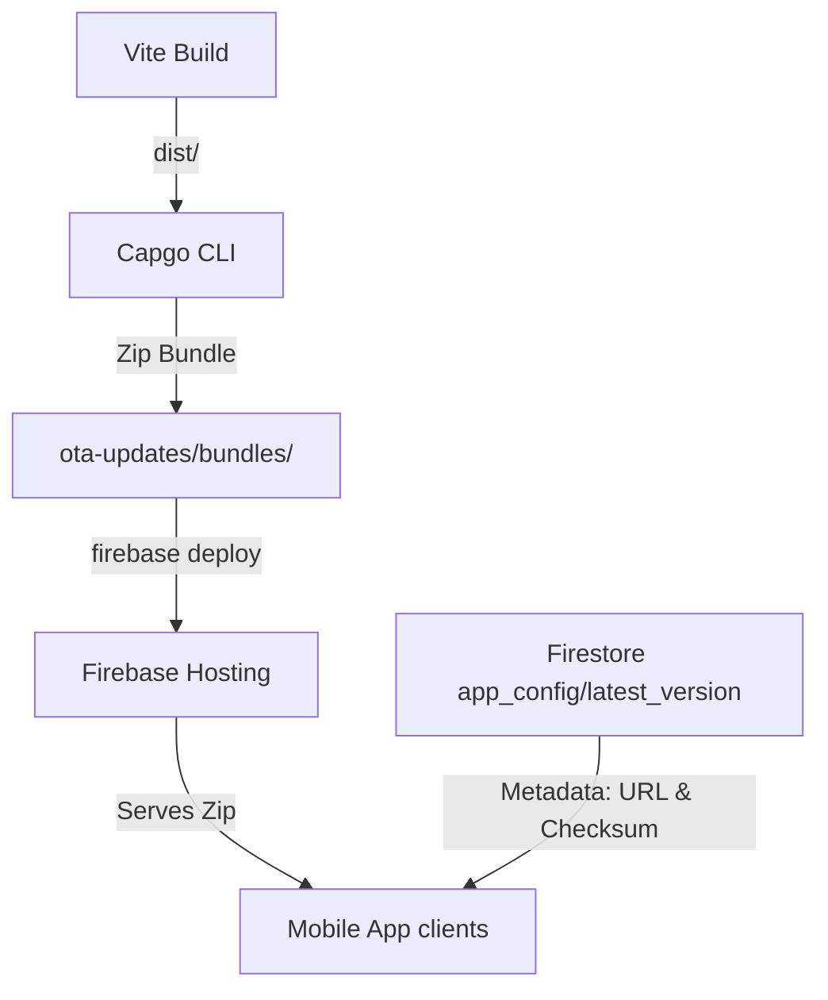

# 📲 SecureVault OTA Update System Guide

> [!IMPORTANT]
> **READ THIS ENTIRE DOCUMENT BEFORE PERFORMING AN OTA UPDATE.**
> This is the definitive, step-by-step source of truth for releasing and debugging Over-The-Air (OTA) updates in the SecureVault app. Any developer or AI assistant executing an OTA release must follow this guide strictly to prevent system inconsistencies, boot loops, or version mismatches.

---

## 🗺️ System Architecture Overview

The SecureVault OTA update system is **self-hosted on Firebase**. Instead of relying on a third-party paid coordinator (like Capgo Cloud), it uses **Firebase Hosting** to serve update bundles and **Firestore** to coordinate release metadata.



### Key Configurations
* **Native App ID:** `com.mohdj.securevault`
* **Firebase Project:** `vault-app-ba6e2`
* **Firebase Hosting Public Root:** `ota-updates/`
  * Direct Bundle Path: `ota-updates/bundles/{version}.zip`
  * Public HTTPS URL: `https://vault-app-ba6e2.web.app/bundles/{version}.zip`
* **Firestore Config Path:** `app_config/latest_version`

---

## 📝 Firestore Metadata Schema

The document `app_config/latest_version` coordinates the OTA updates. It contains the following fields:

| Field Name | Type | Description |
| :--- | :--- | :--- |
| `version` | `string` | The target version (e.g. `4.0.4`). Must match `package.json` and the `.zip` filename. |
| `url` | `string` | The direct download link: `https://vault-app-ba6e2.web.app/bundles/{version}.zip`. |
| `checksum` | `string` | The SHA-256 hash of the final zip bundle. Ensures integrity and prevents corrupt downloads. |
| `critical` | `boolean` | If `true`, the app displays a blocking force-update modal instead of doing a silent background update. |
| `releaseNotes`| `string` | Notes about what changed in the update. |
| `releasedAt` | `string` | ISO timestamp of the release. |
| `min_apk_version` | `string` | *(Optional)* The minimum native APK base version required to apply this OTA. Older APKs will ignore this update. |

> [!WARNING]
> **Always use `{ merge: true }`** when writing to `app_config/latest_version` in Firestore. 
> Native releases (APKs published on GitHub/Stores) write fields like `min_apk_version` and `apk_download_url`. Wiping those fields will break native APK checks.

---

## 🚀 Step-by-Step OTA Release Process

Follow this sequence exactly whenever releasing a new OTA update.

### 1. Pre-Flight Verification
- [ ] **Check the Git Branch:** Confirm you are on the correct branch (e.g. `feature/smart-categorizer-and-autofill` or `main`).
- [ ] **Verify Service Account Key:** Ensure there is a Firebase Admin SDK key file matching `vault-app-ba6e2-firebase-adminsdk*.json` in the project root.
- [ ] **Verify Version Increment:** Open `package.json`. The `version` field **MUST** be strictly greater than the currently deployed OTA version (e.g., if Firestore is running `4.0.4`, the new version in `package.json` must be `4.0.5` or higher).
  > [!CAUTION]
  > Never release an OTA update without incrementing the version in `package.json`. Doing so will lead to checksum mismatches and download-loop bugs on clients.

### 2. Build the Application
Compile the static web assets by running:
```bash
npm run build
```
Verify that the compilation completes with zero errors and populates the `dist/` directory.

### 3. Execute the Automated Release Script
Run the automated release script:
```bash
node scripts/release-ota.mjs
```
This script handles the following pipeline automatically:
1. Reads the version from `package.json`.
2. Zips the `dist/` folder using Capgo CLI to create `ota-updates/bundles/{version}.zip` (Idempotent: skips if the zip for this version already exists).
3. Calculates the SHA-256 checksum of the ZIP file.
4. Deploys the `ota-updates/` folder to Firebase Hosting.
5. Initializes Firebase Admin using the local service account key.
6. Writes the version, URL, checksum, and metadata to Firestore `app_config/latest_version` using a safe **merge write**.

### 4. Verification Check
- [ ] Open a browser and navigate to `https://vault-app-ba6e2.web.app/bundles/{version}.zip` (replace `{version}` with your release). Confirm the download succeeds.
- [ ] Open the Firebase Console, navigate to Firestore, and verify `app_config/latest_version` matches the new version, URL, and checksum.

---

## 🛠️ How the Client-Side Updater Works

The client updater (`src/app/services/updater.ts`) is designed to be self-healing, bulletproof, and crash-resilient.

### 1. Ground-Truth Version Authority
We **never** use `localStorage` as the ground truth for the active version. Stored values are easily wiped or corrupted.
Instead, we query the CapacitorUpdater plugin directly:
```typescript
const current = await CapacitorUpdater.current();
const activeVersion = current?.bundle?.id !== 'builtin' ? current?.bundle?.version : '0.0.0';
```
If the app is running on the builtin package, the active version resolves to `0.0.0`, forcing it to download the latest OTA version.

### 2. The Native Migration Guard
When a user installs a new APK/IPA binary (e.g. from GitHub Releases), any old OTA assets and states become stale. To prevent false-rollback loops:
* During boot, the updater compares the currently running native version with `localStorage.getItem('sv_ota_native_version')`.
* If a mismatch is detected, it clears all stale OTA states:
  * Removes `sv_ota_pending_version`
  * Removes `sv_ota_pending_bundle_id`
  * Removes `sv_ota_failed_versions`
* It then records the new native version to `localStorage`.

### 3. Post-Boot Verification & Rollback Protection
Every time the app starts, it checks if an OTA was pending installation:
* If `sv_ota_pending_bundle_id` is set:
  * If the active bundle ID matches the pending ID, the update succeeded! The pending keys are cleared, and `sv_ota_just_updated` triggers a success toast in `App.tsx`.
  * If the active bundle ID does **NOT** match (meaning the plugin rolled back due to a crash or bad bundle), the update failed. The version is added to the **Failed Version Blacklist** to prevent the app from trying to download and apply that broken version again.

### 4. User-Initiated Update Check
If a manual update check is requested via Settings:
* The failed blacklist is cleared completely (`sv_ota_failed_versions` is wiped).
* This ensures that if a previously failed download was due to an intermittent network issue, the user can still force-update successfully.

---

## 🔍 Troubleshooting & FAQ

### ❓ "I bumped Firestore but the app is not downloading the update"
1. **Check Native Version Compatibility:** Does the update in Firestore have `min_apk_version` set? If the running native APK's version is less than `min_apk_version`, the updater will silently skip it.
2. **Check the Blacklist:** Did this version previously fail to boot on this device? Check if the version is listed in `localStorage.getItem('sv_ota_failed_versions')`. Clear the blacklist by clicking "Check for Updates" manually in the settings.
3. **Compare Versions Semantically:** Semantic version comparison is strict. Ensure the remote version string is semantically greater than the running version (e.g. `4.0.4` is greater than `4.0.3`, but `4.0.4-beta` might not be depending on formatting).

### ❓ "The app is caught in a perpetual download-and-reboot loop"
This occurs if the app successfully downloads the zip but fails to verify it or rolls back on boot.
1. **Verify Checksum:** Run `node scripts/release-ota.mjs` to ensure the ZIP file's actual SHA-256 matches the checksum field in Firestore. If they differ, the app downloads, validates, fails the checksum check, and retries.
2. **Review `App.tsx` Init Sequence:** The CapacitorUpdater plugin requires `notifyAppReady()` to be called immediately upon app boot. If your Javascript code crashes before `notifyAppReady()` is invoked, the native plugin assumes the bundle is corrupted and rolls back to `builtin` on the next boot, causing a rollback loop.

### ❓ "How do I force-reset all OTA state on a simulator or test device?"
Execute this in the web inspector console:
```javascript
localStorage.clear();
```
Then close and restart the app. The app will boot from the builtin assets and treat the active version as `0.0.0`, triggering a fresh download of the latest OTA release.
