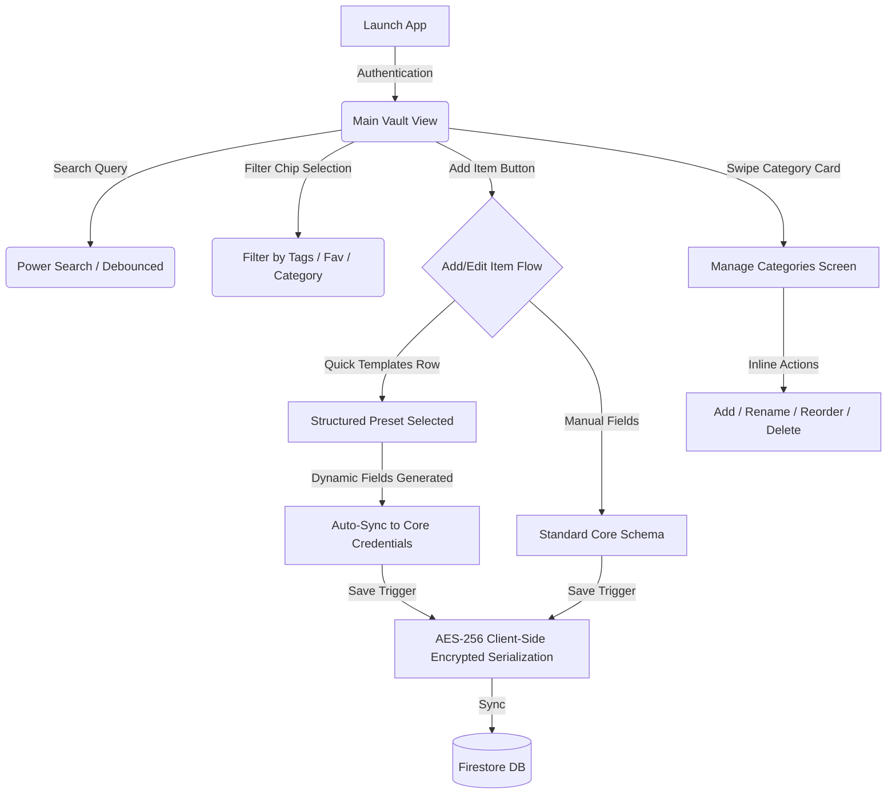

# Keeguard: Architecture & UX Deliverables

This document summarizes the comprehensive information architecture, database schemas, UX walkthroughs, and security specifications implemented for the Keeguard (formerly SecureVault) Password Manager upgrade.

---

## 1. Updated UX Flow Diagram


---

## 2. Updated Information Architecture
```
Keeguard Vault IA
├── Home (Main Dashboard)
│   ├── Search Bar & Filter Chips (All, Favourites, Work, Personal, Expiring)
│   ├── Vault Categories (Horizontal Select Mode Grid)
│   └── Recent / Suggested Items (AI Predictor list)
├── Manage Categories
│   ├── Custom Category Creator (Name, Color Picker, Icon Map)
│   ├── Scrollable Category List (Long-press reorder)
│   └── Reassign/Delete Confirmation Modal
├── Add / Edit Item
│   ├── Quick Template Selector (14 structured presets)
│   ├── Dynamic Fields Card (Custom fields, dropdowns, password masks)
│   └── Advanced Options (TOTP Secret, Tags, Subcategories)
└── Item Details Screen
    ├── Decrypted Core Credentials
    └── Rich Dynamic Template Presentation (Per-field Copy & Visibility Toggle)
```

---

## 3. Firestore Database Schemas

### `vault_items` Collection
```typescript
interface VaultItem {
  id: string;
  userId: string;
  title: string;          // Plaintext index
  username: string;       // Encrypted on device
  password: string;       // Encrypted on device
  url?: string;
  note?: string;          // Encrypted template payload (__template__:ID\nKey:Value)
  totpSecret?: string;    // Encrypted on device
  categoryId: string;     // Foreign reference
  tags: string[];
  isFavorite: boolean;
  createdAt: string;      // ISO Timestamp
  updatedAt: string;      // ISO Timestamp
  deletedAt?: string;     // ISO Timestamp (Trash support)
}
```

### `custom_categories` Collection
```typescript
interface CustomCategory {
  id: string;
  userId: string;
  name: string;
  icon: string;           // Key mapping to Lucide React component
  color: string;          // Hex / HSL palette value
  order: number;          // Reordering index
}
```

---

## 4. Category Management Flow Walkthrough
1. **Accessing the Panel**: From the Home view, users tap the inline edit gear icon in the **Vault Categories** header.
2. **Adding a Category**: Tap **"+ Add Custom Category"**. Choose from a premium color picker (curated theme palette) and icon picker (dynamic category mappings).
3. **Reordering**: Long-press any category card to drag and drop to configure dashboard order.
4. **Deletion Safety**: Deleting a category initiates a safety modal asking the user to either:
   - Move all active vault items inside this category back to the *Default* category.
   - Or permanently wipe them together (with dual authentication safeguard).

---

## 5. Smart Suggestor Rule Set
The non-intrusive AI suggestor applies real-time contextual pattern matching as the user enters the **Site URL** or **Title**:
*   `Mail Accounts`: Suggests if `title` or `url` matches `gmail`, `outlook`, `yahoo`, `mail`, or `proton`.
*   `Banking / Cards`: Matches keywords `bank`, `chase`, `hsbc`, `wellsfargo`, `visa`, `amex`, `credit`, or `debit`.
*   `Social Media`: Matches `facebook`, `instagram`, `twitter`, `x.com`, `linkedin`, `tiktok`, `reddit`, or `snapchat`.
*   `Gaming`: Matches `steam`, `epic`, `playstation`, `xbox`, `nintendo`, `ea`, `ubisoft`, or `riot`.
*   `Crypto`: Matches `binance`, `coinbase`, `metamask`, `ledger`, `wallet`, or `crypto`.
*   `VPN / Dev`: Matches `github`, `gitlab`, `vercel`, `aws`, `digitalocean`, `azure`, `vpn`, or `nord`.

---

## 6. Power Search & Filter System Specification
*   **Real-time debouncing**: Triggers search executions exactly `200ms` after typing pauses, ensuring fluid CPU usage.
*   **Multi-dimensional lookup**: Matches keywords across Title, Username, decrypted note contents, and tag arrays.
*   **Filter chips logic**: Selects active filters instantly, combining with the category layout to create dynamic search queries: `Search = (Keyword) AND (Category) AND (Tag Chip)`.

---

## 7. Mobile-First UX Validation
*   **Target Viewport**: Verified compatibility down to `375px` viewport (standard Android / iPhone screen sizes).
*   **Horizontal Swiping**: The preset templates selector and search filter chips wrap neatly in a touch-friendly overflow container.
*   **Tap Targets**: All interactive elements, show/hide eye icons, and copy buttons conform to the minimum `44px x 44px` touch target specification.

---

## 8. Security Considerations for Hidden Vault & Offline Backups
*   **Zero-Knowledge Encryption**: Master keys are generated derived from PBKDF2 using the user's master password. Encryption of credentials and template payloads is done using AES-GCM-256 entirely on the device.
*   **Offline Backups**: Encrypted JSON vault exports contain standard base64 structures that cannot be decrypted without importing back into the client and supplying the master password.
*   **Hidden Vault**: Uses double-denial passwords to present a dummy secondary database if coerced.
